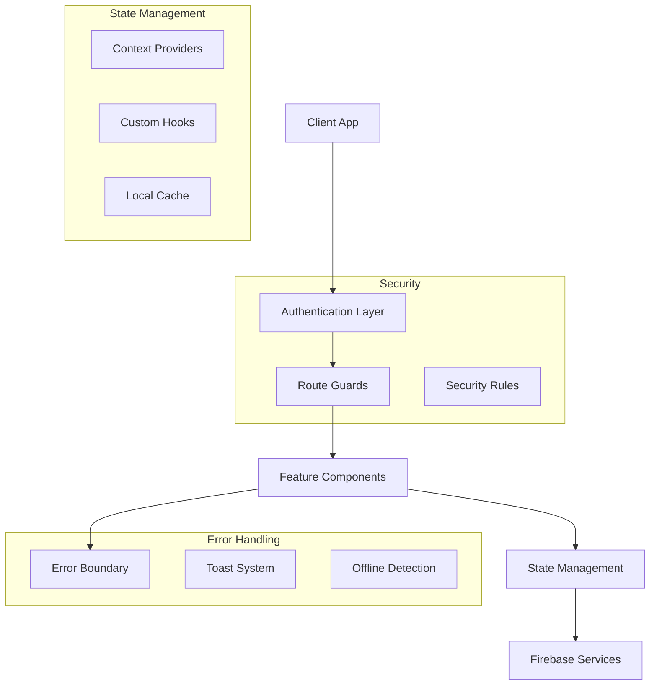
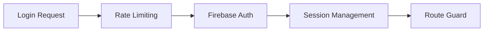
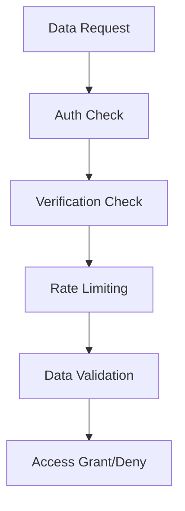
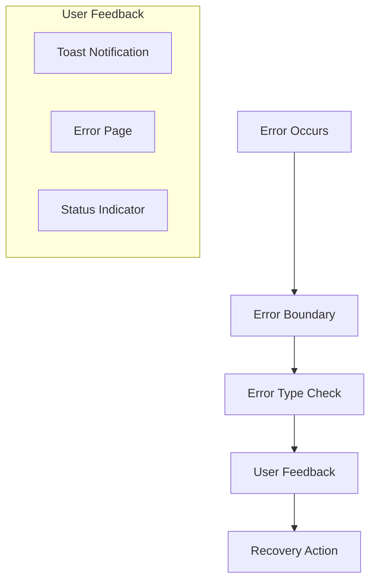
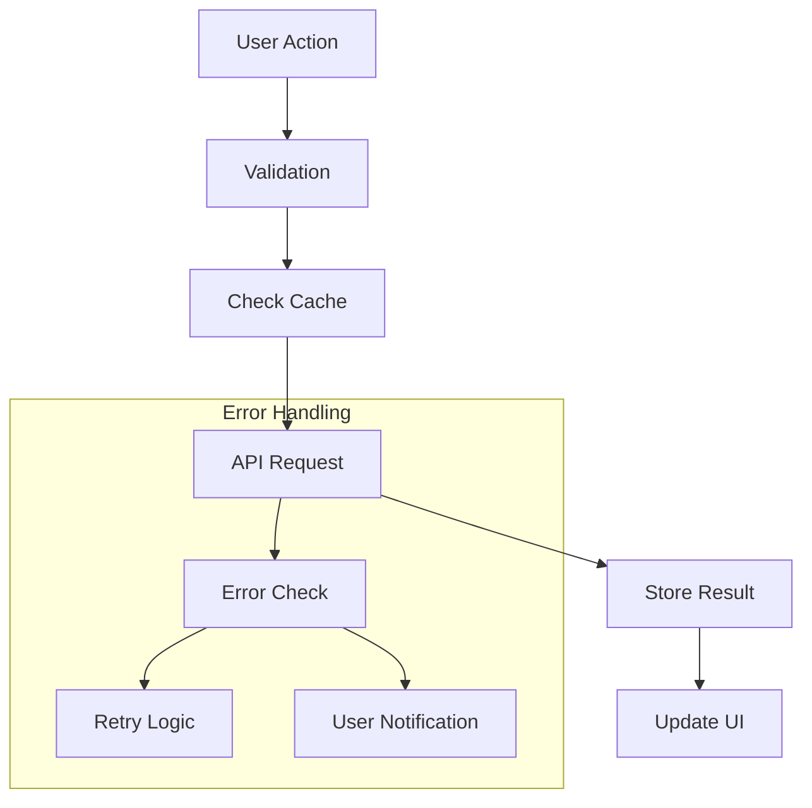

# System Patterns: CampusVibe

## High-Level Architecture


## Security Patterns
### Authentication Flow


### Data Access Rules


## Error Handling Pattern


## Component Architecture
### Core Components
- **ErrorBoundary**: Global error catching and recovery
- **RouteGuard**: Authentication and route protection
- **ToastProvider**: User notifications system
- **OfflineIndicator**: Network status management

### Security Components
- Rate limiting implementation
- Session management
- Data validation
- Access control

### State Management
- Context-based state
- Custom hooks for shared logic
- Local cache management
- Offline state handling

## Security Rules Structure
### Firestore Rules
```javascript
service cloud.firestore {
  match /databases/{database}/documents {
    // Helper Functions
    function isAuthenticated() { ... }
    function isVerified() { ... }
    function notRateLimited() { ... }
    
    // Data Validation
    function isValidUserData() { ... }
    function isValidQuestion() { ... }
    function isValidAnswer() { ... }
    
    // Collection Rules
    match /users/{userId} { ... }
    match /questions/{questionId} { ... }
    match /answers/{answerId} { ... }
    match /chats/{chatId} { ... }
  }
}
```

## Error Recovery Patterns
1. **Component Level**
   - Try-catch blocks
   - Error boundaries
   - Fallback UI
   
2. **Network Level**
   - Offline detection
   - Request retries
   - Cache management
   
3. **User Feedback**
   - Toast notifications
   - Error pages
   - Loading states

## State Management Patterns
1. **Authentication State**
   ```typescript
   interface AuthState {
     user: User | null;
     loading: boolean;
     error: Error | null;
   }
   ```

2. **UI State**
   ```typescript
   interface UIState {
     toasts: Toast[];
     loading: boolean;
     offline: boolean;
   }
   ```

3. **Cache State**
   ```typescript
   interface CacheState {
     data: Record<string, any>;
     timestamp: number;
     valid: boolean;
   }
   ```

## Navigation Patterns
1. **Route Protection**
   - Authentication checks
   - Role verification
   - Onboarding status
   
2. **Deep Linking**
   - State preservation
   - Return path handling
   - Authentication redirect

## Data Flow Patterns


## Performance Patterns
1. **Loading Optimization**
   - Route-based code splitting
   - Lazy loading
   - Preloading critical assets

2. **State Management**
   - Selective re-rendering
   - Memoization
   - State normalization

3. **Data Management**
   - Caching strategies
   - Offline persistence
   - Batch operations
