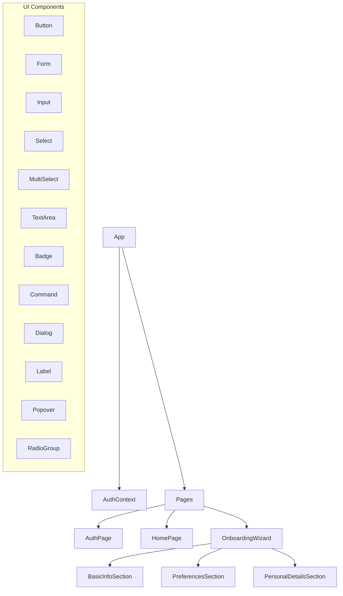
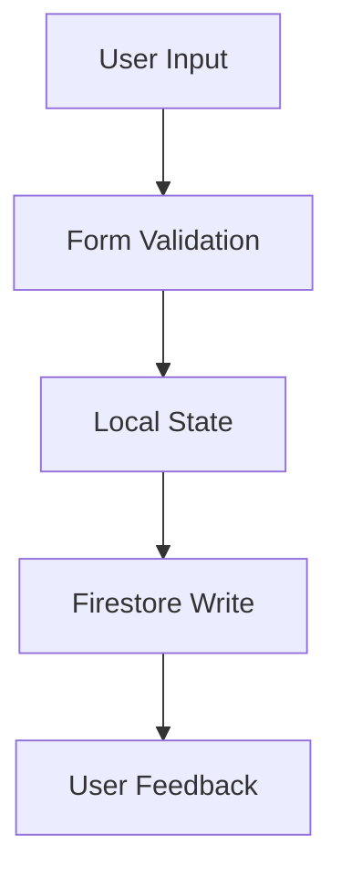
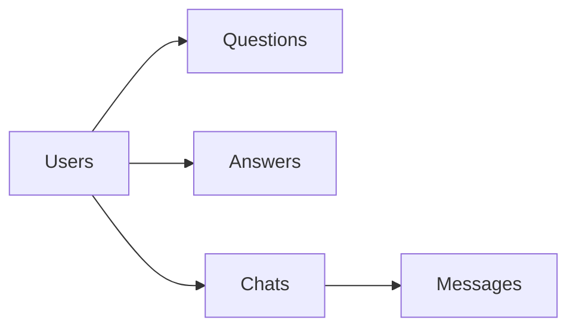

# System Patterns: CampusVibe

## High-Level Architecture
CampusVibe follows a client-server architecture where the client is a web application (built with React) and the backend services are provided by Firebase (Backend-as-a-Service).

```mermaid
graph LR
    User[User Browser] -- HTTPS --> ReactApp[React Web App];
    ReactApp -- Firebase SDK --> FirebaseAuth[Firebase Authentication];
    ReactApp -- Firebase SDK --> Firestore[Firestore Database];
    ReactApp -- Firebase SDK --> FirebaseFunc[(Optional) Cloud Functions];

    subgraph Firebase Backend
        FirebaseAuth
        Firestore
        FirebaseFunc
    end
```

## Component Architecture


## Key Technical Decisions
- **Frontend Framework:** React (using Vite for build tooling)
- **Backend:** Firebase BaaS (Authentication, Firestore, Hosting)
- **Database:** Firestore (NoSQL document database)
- **Authentication:** Firebase Authentication with Google OAuth
- **Real-time Communication:** Firestore's real-time listeners (for chat feature)
- **Form Management:** react-hook-form with Zod validation
- **UI Components:** Shadcn UI with Tailwind CSS
- **Animations:** Framer Motion for transitions

## Component Design Patterns
### Form Management
- Multi-step wizard pattern for complex forms
- Progressive validation using Zod schemas
- Form state management via react-hook-form
- Reusable form sections for maintainability

### UI/UX Patterns
- Consistent gradient styling across CTAs
- Animated transitions between states
- Progress indicators for multi-step processes
- Toast notifications for user feedback
- Responsive design using Tailwind CSS

### Data Flow Patterns


## Database Schema (Firestore)


### Collections Structure
- **users/**
  - User profile data
  - Authentication info
  - Preferences
  - Personal details
  
- **questions/** *(to be implemented)*
  - Question text
  - Author reference
  - Timestamp
  - Tags
  
- **answers/** *(to be implemented)*
  - Answer text
  - Question reference
  - Author reference
  - Timestamp
  
- **chats/** *(to be implemented)*
  - Participant references
  - Status (active/expired)
  - Created timestamp
  - messages/ subcollection

## Critical Implementation Paths
- Secure Firebase service interaction
- Form validation and data integrity
- Real-time chat feature *(upcoming)*
- Daily question limit logic *(upcoming)*
- Compatibility sorting algorithm *(upcoming)*

## Error Handling Patterns
- Form-level validation feedback
- API error handling with user-friendly messages
- Loading states for async operations
- Fallback UI components
- Error boundaries for component failures
